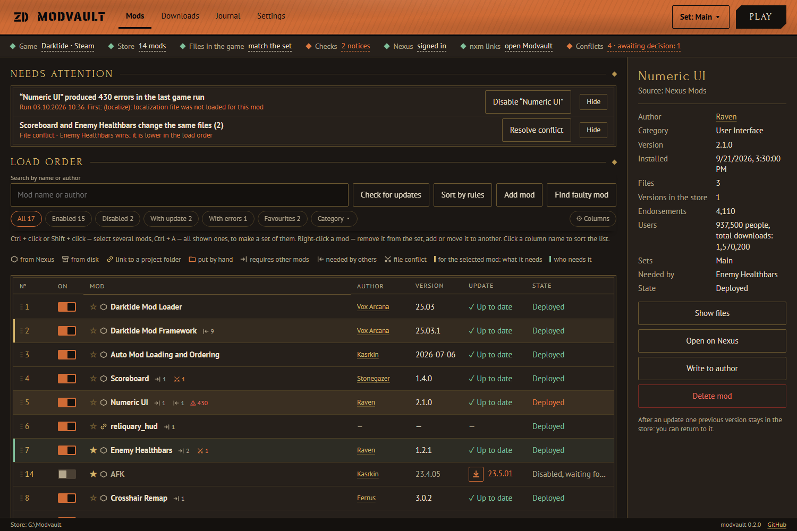
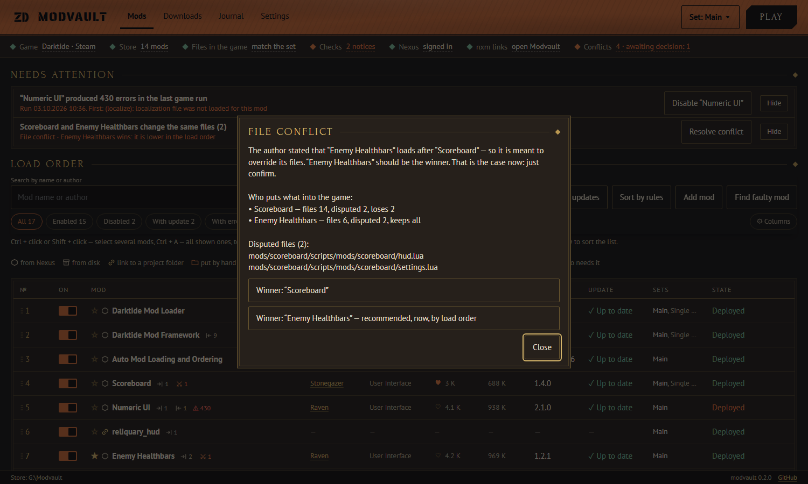
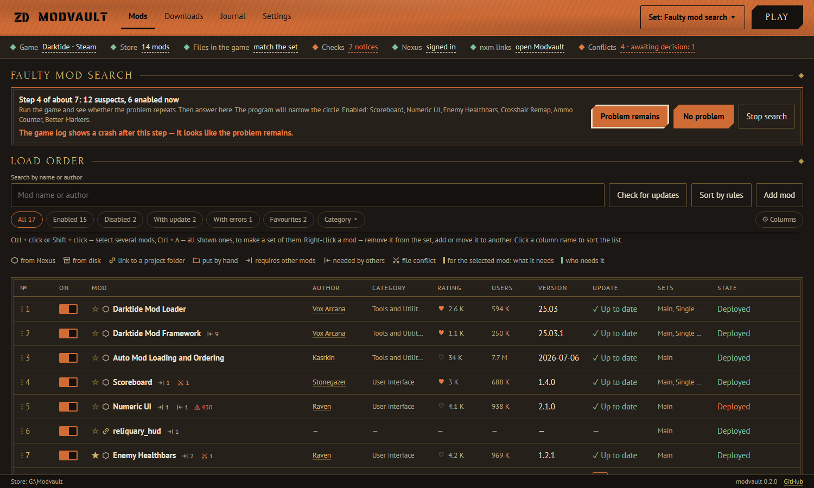
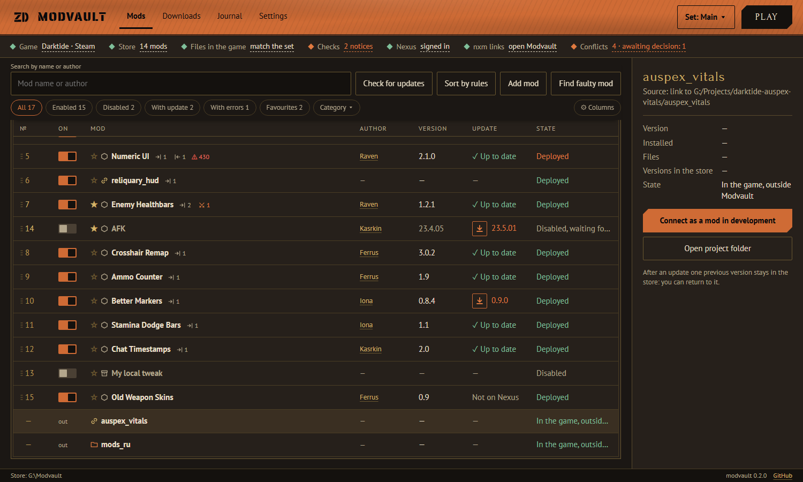
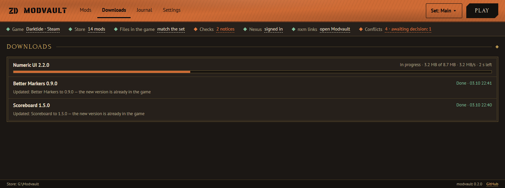
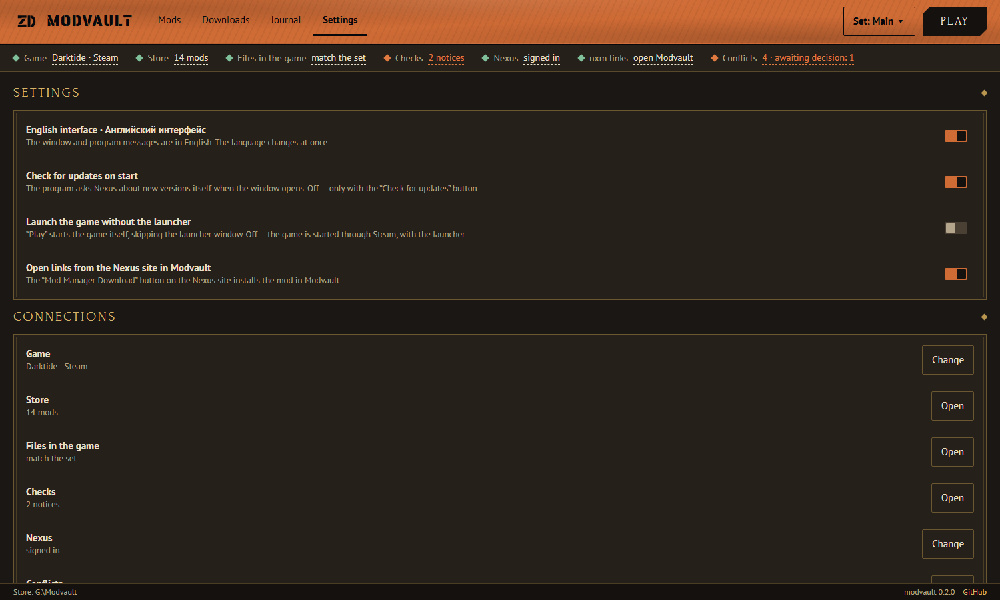

# Modvault

**Mod manager for Warhammer 40,000: Darktide.** Modvault keeps your mods in a separate store, puts them
into the game with hard links in a second, never leaves the game half-changed, and helps you find the
mod that crashes the game. It can take over your Vortex setup in one click — and give it back.

**[⬇ Download the latest version](https://github.com/zemidala/modvault-releases/releases/latest)** — a single `Modvault.exe`, no installation.

English and Russian interface · Русский интерфейс — [see below](#русский)

## Features

### Safe deployment
- **Mods live in a store, not in the game.** By default the store is a `Modvault` folder on the game's drive. Files go into the game as **hard links**, so enabling, disabling and switching sets take seconds and use no extra disk space. On another drive Modvault copies files instead.
- **All or nothing.** Every deployment writes its plan to a journal first. If the program, Windows or the power fails halfway, the next start rolls the game back to its previous state. Nothing is left half-installed.
- **Your files are never lost.** A game file that a mod replaces is backed up and restored when the mod is removed. A mod file changed outside Modvault — by another manager, by you or by the mod itself — is moved to a separate folder, not deleted.
- **Integrity check.** “Files in the game” compares the game folder with the set: changed, missing and game-updated files are listed by name, with the mod they belong to. After a game update or a Steam file check, one click on **Deploy** puts everything back.
- **Deployment plan.** Before deploying you see what will change, mod by mod or file by file.
- `bundle_database.data` is patched for you with the mod loader's own patch tool, on a copy. The original is kept; a backup made before a game update is never put back over the new game.

### Coming from Vortex
- **Take over from Vortex**: mods are copied from the Vortex staging folder with their load order, conflict winners and backups. The game files do not change.
- **Return to Vortex**: one click restores Vortex's deployment byte for byte and returns the `nxm://` links to it. Your mods stay in the Modvault store.

### Load order and checks
- Works with **Darktide Mod Loader** and **Auto Mod Loading and Ordering (AML)**. For AML the list shows the real order the game used last time, read from the loader's log. For plain DML Modvault writes `mod_load_order.txt`.
- **Sort by rules** from the mods' own `.mod` files (`load_before`, `load_after`, `require`), with a preview. Cycles are shown, no mod is ever dropped.
- **Missing requirements**: “X requires Y” with an **Enable Y** button.
- **Drag to reorder**: grab a row by its number, several selected mods at once.

### File conflicts
- Modvault tells **what kind** of conflict it is: identical files, two variants of one mod, a mod fully covered by another, an order stated by the author, or a partial overlap.
- It gives **advice** and the actions to follow it: choose the winner, disable the extra mod, or drop an earlier choice. A pinned winner stays the winner whatever the order.
- Resolved and harmless conflicts do not clutter **Needs attention**. All conflicts are one click away in the status bar.

### Finding the mod that breaks the game
- **Diagnosis after each game run.** Modvault reads the game's own console log and shows which mods logged errors (how many, and the first one) and why the game crashed. The mod gets a ⚠ badge and a **Disable** button.
- **Find faulty mod.** When the log names no culprit, Modvault finds the smallest set of mods that reproduces the problem — a single mod or a combination — by bisection. You run the game and answer “problem remains” or “no problem”; for 140 mods that is about 10 game runs instead of 140. After each run the program reads the log and suggests the answer. The search runs in a temporary set: your own set is not touched and the game returns to it at the end. It survives a restart and can be stopped at any time.

### Mods outside Modvault and mods in development
- Mod folders you put into the game yourself are **shown in the list** with an “out” mark: the loader loads them, so Modvault does not hide them.
- **Take into Modvault**: the mod's files are copied into the store and its files in the game become the mod's files. Nothing else happens — the mod appears disabled, the game is unchanged until you enable it or press **Deploy**.
- **Mods in development**: a folder link (junction) to your project becomes a mod whose files are not copied. The game keeps a link to the project folder, so your edits are in the game at once — and the mod can still be disabled or added to sets. The project folder is never touched.
- Empty folders left by Vortex get a notice with a **Move to Recycle Bin** button.

### Nexus Mods
- **Mod Manager Download** buttons on the Nexus site install mods into Modvault (`nxm://` links, switchable in Settings; the previous handler is remembered and restored).
- **Update check** at start or by button, with progress in the list. Premium accounts download updates directly; without Premium Modvault opens the right file page. **Update** puts the new version straight into the game, and the mod keeps its state: a deployed mod stays deployed, a disabled one stays disabled, other pending changes keep waiting.
- Downloads **resume** after a network failure and are verified by size and MD5 before they reach the store. The **Downloads** tab shows progress, speed and time left.
- **Columns from Nexus**: author (link to the profile), category, endorsements, downloads, update status.
- **Endorse** a mod with the heart in the list, or abstain.
- **Write to author**: a private message on Nexus from the mod card.
- **Collections**: paste a collection link to create a set from it. Mods already in the store are enabled at the collection's version; missing ones are listed with download links.
- Your personal API key is stored in **Windows Credential Manager**, never in a file.

### Mod sets
- **Sets** are like profiles: which mods are enabled. Create, copy, rename and delete them from the header menu. Switching a set deploys it at once.
- Select mods with **Ctrl/Shift + click** → *New set*, *Add to set*, *Enable*, *Disable*, or move them between sets with the right-click menu.
- The mod loader, the framework and required mods are enabled in every set automatically.
- **Set as a file** (`*.modvault-set.json`): share it, and on another PC Modvault creates the set and lists the missing mods with links.

### The window
- **Icons tell what is going on with each mod**: where it comes from (Nexus, disk, project link, outside Modvault), how many mods it requires and how many need it, unresolved file conflicts (click to resolve). Select a mod and the mods it needs and the mods that need it are highlighted. A legend sits above the list.
- **Ctrl + A** selects all shown mods for a new set, adding to a set, enabling or disabling; **Esc** clears the selection.
- Sortable list with a column chooser, quick filters (enabled, disabled, with update, with errors, favourites, category) and search by name or author.
- **Favourites** are shown first. **Version rollback**: one previous version stays in the store after an update; older ones go to the Recycle Bin.
- Add mods by **dragging archives** (zip, 7z, rar) into the window.
- **Play** starts the game through Steam with the launcher, or directly without it.
- **Journal** of everything the program did with mods and the game.
- **Needs attention** explains every notice: click it to see what happened, which files and what the program will do.
- **Settings** are simple switches; a getting-started checklist guides the first run.
- English and Russian interface, switched in Settings without a restart.

*Screenshots show sample data.*

## Requirements

- Windows 10 or 11, 64-bit.
- Microsoft Edge **WebView2 Runtime** — built into Windows 11. On Windows 10, if the window does not open, install it from [Microsoft](https://developer.microsoft.com/microsoft-edge/webview2/).
- Warhammer 40,000: Darktide (Steam) with Darktide Mod Loader. A free Nexus Mods account and a personal API key for Nexus features.

## Install

1. Download `Modvault.exe` from [Releases](https://github.com/zemidala/modvault-releases/releases/latest) and put it in any folder.
2. Run it. The app is not code-signed yet, so Windows SmartScreen may warn you: click **More info → Run anyway**.
3. Follow **Getting started**: choose the game folder, take over from Vortex if you use it, enter your Nexus API key (status bar → *Nexus*).

**Uninstall**: in Modvault, switch off *Open links from the Nexus site* (or click *Return to Vortex*), then delete the exe, the store folder (`Modvault` on the game drive) and `%LOCALAPPDATA%\Modvault`.

## Feedback

- 🐞 Found a bug or want a feature? [Open an issue](https://github.com/zemidala/modvault-releases/issues/new/choose).
- 💬 Questions, ideas, your setups — [Discussions](https://github.com/zemidala/modvault-releases/discussions).

English or Russian — both are fine.

---

## Русский

**Менеджер модов для Warhammer 40,000: Darktide.** Modvault хранит моды в отдельном хранилище, за секунды
кладёт их в игру жёсткими ссылками, никогда не оставляет игру изменённой наполовину и помогает найти мод,
из-за которого игра падает. Перенимает моды у Vortex одной кнопкой — и так же возвращает.

**[⬇ Скачать последнюю версию](https://github.com/zemidala/modvault-releases/releases/latest)** — один файл `Modvault.exe`, без установки.
Русский язык включается в **Settings → English interface** (переключатель выключить) — сразу, без перезапуска.

### Надёжное развёртывание
- **Моды лежат в хранилище, а не в игре** — по умолчанию в папке `Modvault` на диске с игрой. В игру они попадают **жёсткими ссылками**: включение, выключение и смена набора занимают секунды и не занимают места. На другом диске файлы копируются.
- **Всё или ничего.** Каждое развёртывание сначала записывает план в журнал. Если программа, Windows или питание отказали посередине, при следующем запуске игра вернётся в прежнее состояние.
- **Ваши файлы не теряются.** Файл игры, который заменил мод, сохраняется и возвращается при снятии мода. Файл мода, изменённый вне Modvault (другим менеджером, вручную или самим модом), переносится в отдельную папку, а не удаляется.
- **Проверка целостности.** «Файлы в игре» сверяют папку игры с набором: изменённые, пропавшие и заменённые игрой файлы названы поимённо, с модом. После обновления игры или проверки файлов в Steam всё возвращает одна кнопка **«Развернуть»**.
- **План развёртывания**: перед развёртыванием видно, что изменится, — по модам или по файлам.
- `bundle_database.data` патчится сам — инструментом самого загрузчика модов, на копии. Оригинал сохраняется; копия, сделанная до обновления игры, поверх новой игры не возвращается никогда.

### Переход с Vortex
- **«Перенять у Vortex»**: моды копируются из хранилища Vortex вместе с порядком загрузки, победителями конфликтов и резервными копиями. Файлы игры не меняются.
- **«Вернуть Vortex»**: одна кнопка побайтно возвращает развёртывание Vortex и ссылки `nxm://`. Моды остаются в хранилище Modvault.

### Порядок загрузки и проверки
- Работает с **Darktide Mod Loader** и **Auto Mod Loading and Ordering (AML)**. Для AML список показывает настоящий порядок, в котором игра загрузила моды в прошлый раз (из журнала загрузчика). Для обычного DML Modvault пишет `mod_load_order.txt`.
- **Сортировка по правилам** из файлов `.mod` самих модов (`load_before`, `load_after`, `require`) с просмотром. Циклы показываются, ни один мод не теряется.
- **Недостающие зависимости**: «X требует Y» с кнопкой **«Включить Y»**.
- **Перестановка мышью** за номер строки, в том числе нескольких выделенных модов.

### Конфликты файлов
- Modvault определяет **вид** конфликта: файлы одинаковые, два варианта одного мода, мод перекрыт целиком, порядок указал автор, частичное пересечение.
- Даёт **совет** и действия: выбрать победителя, выключить лишний мод, снять прежний выбор. Закреплённый победитель остаётся им при любом порядке.
- Решённые и безвредные конфликты не засоряют «Требуют внимания»; все конфликты — по щелчку в строке состояния.

### Поиск мода, который ломает игру
- **Диагностика после каждого запуска.** Modvault читает журнал самой игры и показывает, какие моды выдали ошибки (сколько и текст первой) и почему игра упала. У мода появляется значок ⚠ и кнопка **«Выключить»**.
- **«Найти сбойный мод».** Если журнал виновника не называет, Modvault делением пополам находит наименьший набор модов, с которым проблема повторяется, — один мод или сочетание. Вы запускаете игру и отвечаете «проблема осталась» или «проблемы нет»; для 140 модов это около 10 запусков вместо 140. После каждого запуска программа читает журнал и подсказывает ответ. Поиск идёт во временном наборе: ваш набор не меняется, в конце игра возвращается к нему. Поиск переживает перезапуск и прерывается в любой момент.

### Моды вне Modvault и моды в разработке
- Папки модов, которые вы положили в игру сами, **видны в списке** с пометкой «вне»: загрузчик их грузит, и Modvault их не прячет.
- **«Взять в Modvault»**: файлы мода копируются в хранилище, а файлы в игре становятся файлами этого мода. Больше ничего не происходит — мод появляется выключенным, игра не меняется, пока вы его не включите или не нажмёте **«Развернуть»**.
- **Моды в разработке**: ссылка на папку проекта (junction) становится модом, файлы которого не копируются. В игре остаётся ссылка на проект — правки сразу в игре, а мод при этом можно выключать и включать в наборы. Папка проекта не трогается.
- Пустые папки, оставшиеся от Vortex, — замечание с кнопкой **«Убрать в Корзину»**.

### Nexus Mods
- Кнопки **«Mod Manager Download»** на сайте Nexus ставят моды в Modvault (ссылки `nxm://`, включаются в настройках; прежняя программа запоминается и возвращается).
- **Проверка обновлений** при запуске или по кнопке, с ходом прямо в списке. С Premium обновление качается сразу, без него открывается страница нужного файла. **«Обновить»** сразу кладёт новую версию в игру, а мод остаётся в прежнем состоянии: развёрнутый — развёрнутым, выключенный — выключенным; другие ждущие изменения продолжают ждать.
- Загрузка **докачивается** после обрыва сети и сверяется по размеру и MD5, прежде чем попасть в хранилище. Раздел **«Загрузки»** показывает ход, скорость и оставшееся время.
- **Столбцы с Nexus**: автор (ссылка на профиль), категория, одобрения, скачивания, состояние обновления.
- **Одобрить мод** сердечком в списке или воздержаться.
- **Написать автору**: личное сообщение на Nexus из карточки мода.
- **Коллекции**: по адресу коллекции создаётся набор. Моды, которые уже есть в хранилище, включаются в версии коллекции; недостающие перечисляются со ссылками на загрузку.
- Личный API-ключ хранится в **диспетчере учётных данных Windows**, а не в файле.

### Наборы модов
- **Наборы** — как профили: какие моды включены. Создать, скопировать, переименовать, удалить — в меню шапки. Смена набора сразу приводит к нему игру.
- Выделите моды **Ctrl/Shift + щелчок** → «В новый набор», «Добавить в набор», «Включить», «Выключить»; или переносите моды между наборами через меню правой кнопки.
- Загрузчик, фреймворк и нужные модам зависимости включаются в каждом наборе сами.
- **Набор как файл** (`*.modvault-set.json`): поделитесь им — на другом компьютере Modvault создаст набор и перечислит недостающие моды со ссылками.

### Окно
- **Значки показывают, что с модом**: откуда он (Nexus, диск, ссылка на проект, вне Modvault), сколько модов ему нужно и скольким нужен он, нерешённые конфликты файлов (щелчок — разбор). Выберите мод — подсветятся моды, которые ему нужны, и моды, которым нужен он. Над списком — легенда.
- **Ctrl + A** выделяет все видные моды — для нового набора, добавления в набор, включения или выключения; **Esc** снимает выделение.
- Список с сортировкой по столбцам, выбором столбцов, быстрыми фильтрами (включённые, выключенные, с обновлением, с ошибками, избранные, категория) и поиском по названию или автору.
- **Избранное** стоит первым. **Откат версии**: после обновления в хранилище остаётся одна прежняя версия, более старые уходят в Корзину.
- Моды добавляются **перетаскиванием архивов** (zip, 7z, rar) в окно.
- **«Играть»** запускает игру через Steam с лаунчером или напрямую, без него.
- **Журнал** всего, что программа делала с модами и игрой.
- **«Требуют внимания»** объясняет каждое замечание: щёлкните его — увидите, что случилось, какие файлы и что сделает программа.
- **Настройки** — простые переключатели; памятка «Начало работы» проводит через первый запуск.
- Английский и русский интерфейс, переключается в настройках без перезапуска.

### Требования
- Windows 10 или 11, 64 бита.
- **WebView2 Runtime** от Microsoft — встроен в Windows 11. Если на Windows 10 окно не открывается, установите его с [сайта Microsoft](https://developer.microsoft.com/microsoft-edge/webview2/).
- Warhammer 40,000: Darktide (Steam) с Darktide Mod Loader. Для функций Nexus — бесплатная учётная запись Nexus Mods и личный API-ключ.

### Установка
1. Скачайте `Modvault.exe` со страницы [релизов](https://github.com/zemidala/modvault-releases/releases/latest) и положите в любую папку.
2. Запустите. Программа пока не подписана цифровой подписью, поэтому Windows SmartScreen может показать предупреждение: нажмите **Подробнее → Выполнить в любом случае**.
3. Пройдите «Начало работы»: выберите папку игры, перенимите моды у Vortex, если пользуетесь им, введите ключ Nexus (строка состояния → «Nexus»).

**Удаление**: в Modvault выключите «Открывать ссылки с сайта Nexus в Modvault» (или нажмите «Вернуть Vortex»), затем удалите exe, папку хранилища (`Modvault` на диске с игрой) и `%LOCALAPPDATA%\Modvault`.

Нашли ошибку — [создайте issue](https://github.com/zemidala/modvault-releases/issues/new/choose); вопросы и идеи — в [Discussions](https://github.com/zemidala/modvault-releases/discussions). Писать можно по-русски.
